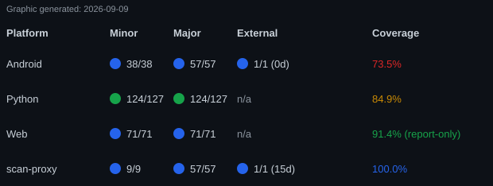

# RigCheck / HDTTools

**RigCheck** is an experimental RV/trailer tow-weight safety checker: get
the numbers off a truck's compliance label, a trailer's compliance label,
and a CAT Scale weigh ticket — by photo or by typing them in — and it
computes an axle-by-axle pass/fail breakdown against each axle's rated
limit. It's an experimental learning project, not a certified safety
tool — every version shows a blocking "not for safety decisions"
disclaimer before results.



Per-platform test status (Minor/Major, run fresh) and External status
(last real run) and code coverage — regenerate via `uv run
scripts/generate_dashboard.py`, see `TESTING.md`'s "Dashboard" section.

RigCheck ships on three platforms, each self-contained (no shared backend
or database):

- **Desktop** (`streamlit_app/`) — a single-process Streamlit app, local
  OCR via Tesseract.
- **Web** (`web/` + `src/hdttools/api/`) — a React frontend talking to a
  stateless FastAPI backend, local OCR via Tesseract.
- **Android** (`android/`) — native Kotlin/Compose app. Free offline
  manual entry by default, plus an optional paid Claude-vision "scan
  instead of type" feature (take a photo or pick one from the gallery;
  billed in RevenueCat-managed credits).

This repo also contains the underlying Python extraction toolkit
(`hdttools`) that the Desktop/Web OCR paths are built on — usable
directly as a library, see "Underlying toolkit" below.

For current status and the prioritized roadmap, see
[`NEXT_STEPS.md`](NEXT_STEPS.md) — the maintained, cross-session record.
Detailed project history (the Android monetization backend, deployment
notes, and everything below this file's scope) lives in that file's
linked `ARCHIVE_*.md` files, split by topic to keep `NEXT_STEPS.md`
itself cheap to read.

## Desktop (Streamlit)

```
uv sync --extra streamlit
uv run --extra streamlit streamlit run streamlit_app/app.py
```

Opens at `http://localhost:8501`. Requires Tesseract — see "Tesseract"
below. See [`streamlit_app/README.md`](streamlit_app/README.md) for more,
including deployment notes.

**Live demo**: https://hdttools-ynfeq8py78ghmeyulo2grr.streamlit.app

## Web

```
# Backend (FastAPI), from the repo root
uv sync
uv run uvicorn hdttools.api.main:app --reload --port 8000

# Frontend (React + Vite), in a second terminal
cd web
npm install
npm run dev
```

Frontend runs on `http://localhost:5173`, backend on
`http://localhost:8000` (`/docs` for Swagger UI). Also requires
Tesseract — see below. See [`web/README.md`](web/README.md) for more.

## Android

Native Kotlin/Compose app — manual entry is free and fully offline by
default, with an optional paid Claude-vision "scan instead of type"
feature backed by `workers/scan-proxy/` (a Cloudflare Worker — already
deployed and verified end-to-end, see `ARCHIVE_MONETIZATION.md`).

**Current status**: all 6 planned phases are done and verified on a real
emulator — truck tag, trailer tag, and CAT Scale ticket entry (manual or
scanned), the axle-by-axle breakdown/verdict screen, recent-rig
shortcuts, and the paid scan feature end to end: take a photo or choose
an existing one from the gallery, RevenueCat-managed credit balance, and
a custom paywall with real Test Store pricing. A committed Compose UI
test suite (30 tests, fully offline) now backs the screens and
navigation flow — see `android/TESTING.md`. See `ARCHIVE_ANDROID.md` for
the full build-out history, or `NEXT_STEPS.md`'s roadmap for remaining
polish/test gaps.

```
cd android
./gradlew test                       # business-logic + RevenueCatManager unit tests
./gradlew connectedDebugAndroidTest   # Compose UI tests — needs a running emulator/device
./gradlew assembleDebug               # build the debug APK
```

Requires Android Studio (bundles the JDK) and its SDK — see
`NEXT_STEPS.md` for this project's environment setup notes and gotchas.

## Tesseract (for the Desktop/Web local-OCR path)

Desktop and Web both extract label/ticket fields via local OCR
(`pytesseract`), which requires the Tesseract OCR engine installed
separately — not just the `pytesseract` pip package. On Windows: install
from the community builds at
https://github.com/UB-Mannheim/tesseract/wiki. It's auto-detected on PATH
or at the default install location (`C:\Program Files\Tesseract-OCR`), and
also auto-detected on common macOS (Homebrew) and Linux install locations.

Accuracy is noticeably lower than the Claude-vision version, particularly
for fields near dense boilerplate text or small print — that's what the
review/repair step is for.

## Underlying toolkit: `hdttools` (Python library/CLI)

Alongside RigCheck, this repo's original tool: standalone functions that
prompt for a photo, extract structured fields (via Claude vision or local
Tesseract OCR), show an editable review form, and save the result — no
wizard flow, just direct library use.

```
uv sync
```

```python
from hdttools import read_scale_ticket, read_truck_tag, read_trailer_tag

ticket = read_scale_ticket()   # prompts for a file, review/repair, then saves
truck = read_truck_tag()       # prompts for a file + vehicle name, review/repair, then saves
trailer = read_trailer_tag()   # prompts for a file + vehicle name, review/repair, then saves
```

Each function returns the saved record, or `None` if the user cancels the
review step instead of saving. Records are saved to `hdttools.db`
(SQLite) in the working directory, one table per record type
(`scale_tickets`, `truck_tags`, `trailer_tags`).

`read_scale_ticket`, `read_truck_tag`, and `read_trailer_tag` extract data
via the Claude API and require an `ANTHROPIC_API_KEY` environment
variable. `hdttools.scale_ticket_ocr.read_scale_ticket` is a drop-in
alternative using local Tesseract OCR instead, so no API key or network
access is needed (see "Tesseract" above).

## Testing

```
uv run pytest -q          # Python (CLI, API, breakdown logic)
uv run pytest --cov       # with coverage
```

```
cd android && ./gradlew test                       # JVM unit tests (business logic, RevenueCatManager)
cd android && ./gradlew connectedDebugAndroidTest   # Compose UI tests (screens, navigation) — needs a running emulator/device
```

The instrumented suite runs fully offline (a custom test `Application`
skips RevenueCat configuration) — see
[`android/TESTING.md`](android/TESTING.md) for what each test covers and
what's deliberately deferred to the real-RevenueCat External suite.

```
cd workers/scan-proxy && npm run test:sanity   # Minor: fast smoke subset, <1s, no network — run before every commit
cd workers/scan-proxy && npm test              # Major: full mocked regression suite, no network
```

The Worker's tests are organized around the root `TESTING.md`'s
Minor/Major/External model (`test:sanity` = Minor, `test` = Major,
`test:weekly`/`test:release` = External's two suites) — see
[`workers/scan-proxy/TESTING.md`](workers/scan-proxy/TESTING.md) for what
each category and individual test covers, or `ARCHIVE_TESTING.md` for the
narrative history of how it got built.

## Project layout

- `src/hdttools/models.py` — dataclasses for extracted records
- `src/hdttools/vision_client.py` — shared Claude-vision extraction helper
- `src/hdttools/file_picker.py` — shared file-picker / vehicle-name prompt (no API dependency)
- `src/hdttools/scale_ticket.py`, `truck_tag.py`, `trailer_tag.py` — Claude-vision readers
- `src/hdttools/scale_ticket_ocr.py`, `truck_tag_ocr.py`, `trailer_tag_ocr.py` — local-OCR alternatives
- `src/hdttools/review_form.py` — generic GUI review/repair form
- `src/hdttools/database.py` — SQLite persistence (CLI tool only)
- `src/hdttools/api/` — stateless FastAPI backend for the web frontend (no persistence)
- `tests/` — pytest suite
- `web/` — React + Vite frontend (RigCheck Web)
- `streamlit_app/` — self-contained Streamlit frontend (RigCheck Desktop)
- `android/` — native Kotlin/Compose app (RigCheck Android)
- `workers/scan-proxy/` — Cloudflare Worker backing Android's paid scan feature
- `ANDROID_DESIGN_BRIEF.md` — Android screen-by-screen design reference
- `NEXT_STEPS.md` — the maintained, cross-session project record (roadmap
  + current status; links out to `ARCHIVE_*.md` for detailed history)
